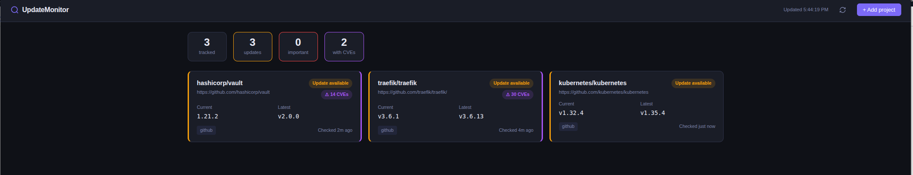
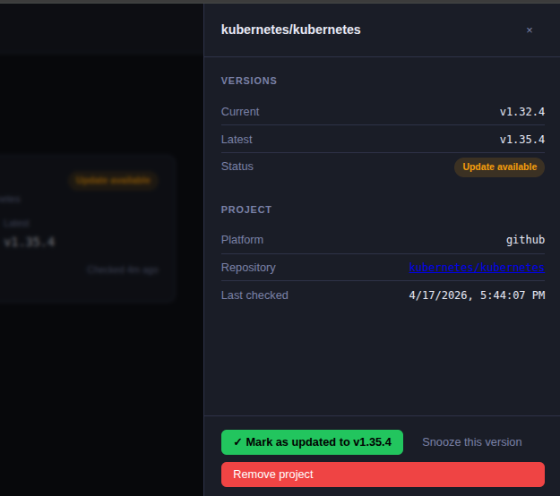

Still working on it, wait for seen good results. 
:)

-----------------------------------------

# UpdateMonitor

A self-hosted dashboard that monitors external software projects for new releases and tells you what changed — powered by Go, S3, and Claude AI.

<p align="center">
  
</p>
<p align="center">
  
</p>
---

## What it does

You give it a list of GitHub or GitLab repositories and the version you are currently running. UpdateMonitor checks for new releases every 30 minutes and shows you a clear dashboard of what is up to date and what needs attention. When a new version is detected, Claude summarizes the changelog in plain English and flags whether the update is important (security fix, breaking change, major feature).

---

## Features

- Track any number of public GitHub and GitLab repositories
- Automatic version checks every 30 minutes via a cron scheduler
- AI-generated update summaries — what changed and whether it matters
- Notifications on update detection: Slack webhooks and email (SMTP)
- Persistent storage as a JSON file on Amazon S3
- Clean monitoring dashboard — dark theme, no heavy frontend frameworks
- Admin-key protected write API, designed for future Keycloak integration
- Docker-first: single container, LocalStack for local S3 in development

---

## Requirements

- Go 1.23+
- Docker and Docker Compose
- An S3 bucket (or LocalStack for local development)
- An Anthropic API key for AI summaries (optional — summaries are skipped if not set)

---

## Quick start (local development)

```bash
# 1. Clone and enter the project
git clone https://github.com/bortizllamas/UpdateMonitor
cd UpdateMonitor

# 2. Create your env file
cp .env.example .env
# Edit .env — set SERVER_ADMIN_KEY and optionally AI_API_KEY
# S3 is handled by LocalStack in dev; no AWS account needed

# 3. Start everything
docker compose up --build

# 4. Open the dashboard
open http://localhost:8080
```

The `docker-compose.yml` starts the app alongside LocalStack (a local S3 emulator) and creates the dev bucket automatically.

---

## Production deployment

```bash
# Build the image
docker build -t UpdateMonitor:latest .

# Create a .env from the example and fill in real values
cp .env.example .env

# Run with the production compose file
docker compose -f deploy/docker-compose.prod.yml --env-file .env up -d
```

Your S3 bucket must exist before starting. The app writes a single file (`UpdateMonitor/projects.json`) to it.

---

## Configuration

All configuration can be provided as environment variables. A JSON config file is also supported for values you prefer not to set as env vars; point to it with `CONFIG_FILE=/path/to/config.json`.

See [`config.example.json`](config.example.json) for the full structure and [`.env.example`](.env.example) for all supported variables.

### Key variables

| Variable | Default | Description |
|---|---|---|
| `SERVER_PORT` | `8080` | HTTP listen port |
| `SERVER_ADMIN_KEY` | — | Required. Protects write endpoints |
| `S3_BUCKET` | — | Required. S3 bucket name |
| `S3_REGION` | `us-east-1` | AWS region |
| `S3_PREFIX` | `UpdateMonitor/` | Key prefix inside the bucket |
| `S3_ENDPOINT` | — | Custom endpoint for LocalStack / MinIO |
| `AWS_ACCESS_KEY_ID` | — | AWS credentials (if not using IAM role) |
| `AWS_SECRET_ACCESS_KEY` | — | AWS credentials (if not using IAM role) |
| `GITHUB_TOKEN` | — | Raises rate limit from 60 to 5 000 req/hr |
| `GITLAB_TOKEN` | — | Personal access token for GitLab |
| `GITLAB_BASE_URL` | `https://gitlab.com` | Override for self-hosted GitLab |
| `AI_API_KEY` | — | Anthropic API key for update summaries |
| `AI_MODEL` | `claude-sonnet-4-6` | Claude model to use |
| `SLACK_WEBHOOK_URL` | — | Default Slack webhook for notifications |
| `SMTP_HOST` | — | SMTP server for email notifications |
| `SMTP_PORT` | `587` | SMTP port |
| `SMTP_USER` | — | SMTP username |
| `SMTP_PASSWORD` | — | SMTP password |
| `SMTP_FROM` | — | Sender address |
| `CHECK_INTERVAL` | `*/30 * * * *` | Cron expression for version checks |
| `TZ` | `UTC` | Container timezone (affects cron schedule) |
| `CONFIG_FILE` | — | Path to a JSON config file |

---

## REST API

The frontend consumes this API directly. You can also use it from scripts or CI.

### Public endpoints

```
GET  /healthz              Liveness probe — returns "ok"
GET  /api/projects         List all tracked projects
GET  /api/projects/{id}    Get a single project by ID
```

### Admin-protected endpoints

All write endpoints require the `X-Admin-Key` header (or `Authorization: Bearer <key>`).

```
POST   /api/projects        Add a project
DELETE /api/projects/{id}   Remove a project
POST   /api/check           Trigger an immediate version check for all projects
```

#### Add a project — request body

```json
{
  "url": "https://github.com/owner/repo",
  "current_version": "v1.2.3",
  "name": "My Project",
  "notifications": [
    { "type": "slack",  "address": "https://hooks.slack.com/services/..." },
    { "type": "email",  "address": "you@example.com" }
  ]
}
```

`name` and `notifications` are optional. The platform (GitHub or GitLab) is inferred from the URL.

#### Project object

```json
{
  "id": "550e8400-...",
  "name": "owner/repo",
  "url": "https://github.com/owner/repo",
  "platform": "github",
  "owner": "owner",
  "repo": "repo",
  "current_version": "v1.2.3",
  "latest_version": "v1.4.0",
  "update_available": true,
  "update_important": false,
  "update_summary": "This release adds X and fixes Y. Low risk for most users.",
  "last_checked": "2026-04-16T12:00:00Z",
  "created_at": "2026-04-01T09:00:00Z",
  "updated_at": "2026-04-16T12:00:00Z"
}
```

---

## Project structure

```
UpdateMonitor/
├── cmd/server/main.go                    Entry point — wires all dependencies
├── internal/
│   ├── domain/                           Core entities: Project, VersionInfo, VersionDiff
│   ├── ports/ports.go                    Interface contracts (Storage, Tracker, AI, Notifier)
│   ├── adapters/
│   │   ├── storage/s3/                   S3-backed JSON persistence
│   │   ├── tracker/github/               GitHub Releases + Tags API
│   │   ├── tracker/gitlab/               GitLab Releases + Tags API v4
│   │   ├── ai/claude/                    Anthropic Claude — changelog analysis
│   │   ├── notifier/slack/               Slack incoming webhook
│   │   └── notifier/email/               SMTP email
│   ├── service/project.go                All use-cases: add, list, delete, checkAll
│   ├── api/                              HTTP server, routes, middleware
│   ├── scheduler/scheduler.go            robfig/cron wrapper
│   └── config/config.go                  JSON + env var configuration
├── web/
│   ├── templates/index.html              Dashboard shell
│   └── static/
│       ├── css/main.css                  Dark monitoring theme
│       └── js/app.js                     Vanilla JS — no framework
├── Dockerfile                            Multi-stage build, distroless runtime
├── docker-compose.yml                    Development (LocalStack)
├── deploy/docker-compose.prod.yml        Production (real AWS)
└── scripts/localstack-init.sh            Creates the dev S3 bucket on startup
```

The architecture follows the hexagonal pattern: all external services are behind interfaces defined in `internal/ports`. Swapping the storage backend, adding a new tracker, or replacing the AI provider only requires a new adapter.

---

## Adding a project via curl

```bash
curl -s -X POST http://localhost:8080/api/projects \
  -H "Content-Type: application/json" \
  -H "X-Admin-Key: your-admin-key" \
  -d '{
    "url": "https://github.com/cli/cli",
    "current_version": "v2.45.0"
  }' | jq .
```

Trigger an immediate check without waiting for the scheduler:

```bash
curl -s -X POST http://localhost:8080/api/check \
  -H "X-Admin-Key: your-admin-key" | jq .
```

---

## Notifications

Notifications are configured per project in the `notifications` array. Each entry has a `type` (`slack` or `email`) and an `address`.

You can also set a global default Slack webhook via `SLACK_WEBHOOK_URL` — it is used for any project that does not have its own Slack target defined.

Notifications fire once when a new `latest_version` is detected, not on every check.

---

## Authentication

By default, all write endpoints require `X-Admin-Key`. Set `SERVER_ADMIN_KEY` to a strong random string.

The read API (`GET /api/projects`) is intentionally public so the dashboard works without credentials in the browser.

The auth layer is structured for future Keycloak/OIDC integration — the `AdminOnly` middleware in `internal/api/middleware.go` is the single place to swap in JWT validation.

---

## Dependencies

| Package | Purpose |
|---|---|
| `go-chi/chi` | HTTP router |
| `aws-sdk-go-v2` | S3 storage |
| `google/go-github` | GitHub API client |
| `anthropics/anthropic-sdk-go` | Claude AI |
| `robfig/cron` | Scheduler |
| `google/uuid` | Project IDs |

GitLab uses the REST API v4 directly with no external client library.

---

## License

MIT
